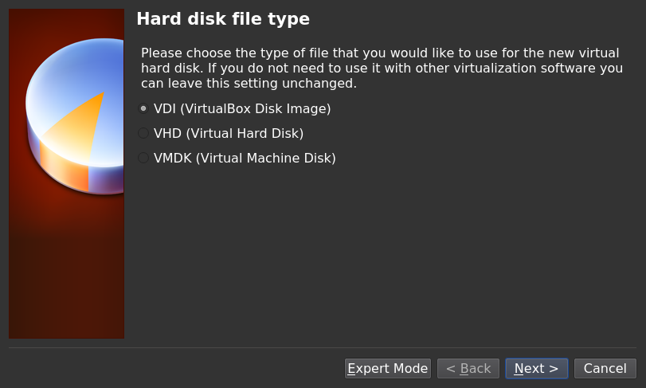
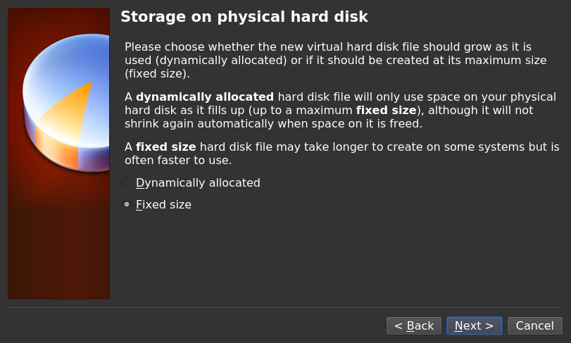
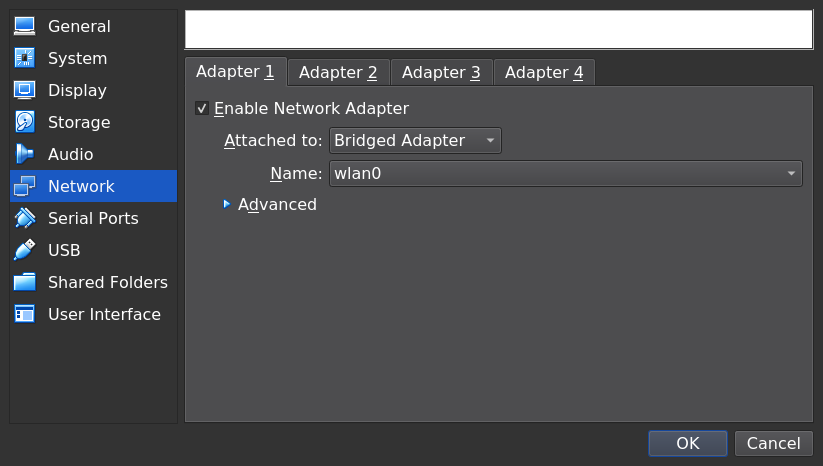

+++
title = "Installing: Creating a VirtualBox Virtual Machine"
MenuTitle = "VirtualBox VMs"
Description = "Simple instructions to create and configure a virtual machine for Project Trident."
chapter = false
weight = 2
pre = "<i class='fas fa-info'></i>   "
+++

## Virtualization

A virtualized environment allows users to test drive an operating system without overwriting the current operating system.
This is an excellent way to test drive an operating system, determine hardware support, or try multiple operating system versions.
Virtualization software creates a Virtual Machine (VM), a software-created computer environment that can install and run an operating system.
The only limitation to virtualization is the system hardware.
The virtual environment operating system can run slowly if the host computer has limited amounts CPU and RAM.
Closing other non-essential applications on the host computer can free more CPU and RAM for the virtual machine.

### VirtualBox

VirtualBox is a popular virtualization software available for Project Trident.
Installing VirtualBox through the AppCafe or typing `sudo pkg install virtualbox-ose` on the command line installs all required dependencies.
Installing the *virtualbox-ose-additions* package (also known as VirtualBox Guest Additions) can greatly improve the performance of Project Trident or other guest operating systems.
The guest additions add mouse pointer integration, shared folders between the host and guest (depending on the guest OS), improved video support, and a shared clipboard.

VirtualBox does not currently support the shared folders feature with a Project Trident guest.
To share files between the host and a Project Trident guest, use an NFS share.

Please see the [VirtualBox website](https://www.virtualbox.org/) for additional information.
The [VirtualBox Guest Additions](http://www.virtualbox.org/manual/ch04.html) page has support information and usage instructions.

Running VirtualBox on a Project Trident system for the first time automatically gives the user account that started VirtualBox the necessary permissions to run the application.
This could break existing shortcuts to VirtualBox.
To fix a broken shortcut, log out and in again.

### Creating a Virtual Machine for a Project Trident Install

This section describes how to prepare VirtualBox for an installation of Project Trident using an *.iso* file.

Install VirtualBox on the host system, download a Project Trident ISO from [the website](https://www.Trident.org/downloads/),  and create a new virtual machine to install Project Trident as a guest OS.
Configure the virtual machine (VM) for a Project Trident guest:

- Assign memory to the VM: 4 GB is recommended, but the system can run slowly with 2 GB.
- Create a 30-50 GB virtual disk for the guest operating system and any downloaded software.
  Adjust the virtual disk size as necessary to match the intended use for the operating system, but the virtual disk should not be less than 15 GB.
- Open the settings for the VM after it is created and set the network adapter to be *bridged*.
  This will allow the guest operating system to connect to the Internet through the host system.

Start VirtualBox to begin creating the VM.

Click *New* to start the new virtual machine wizard.

Enter a descriptive name for the virtual machine.
Open the **Operating System** drop-down menu and select *BSD*.
In the **Version** drop-down menu, select *FreeBSD (64 bit)*.
Click *Next*.

The base memory size must be changed to **at least 2048 MB.**
Assigning more RAM improves the guest operating system performance.
Any number within the green area is considered a "safe" value by VirtualBox and should not impact the host computer performance.
When finished, click *Next*.

This section is for allocating host computer disk space to the guest operating system or creating a virtual hard drive.
Using the default choices is generally recommended.
Click *Create* to configure the virtual hard disk.
An existing virtual disk can be reused by selecting *Use an existing virtual hard drive file* from the drop-down menu.
Create as many virtual drives as desired.
Consider reusing existing virtual hard drives to save space on the physical hard drive.

Select *VDI* and click *Next*.

Choose whether to have *Dynamically allocated* or *Fixed size* storage.
*Dynamically allocated* uses disk space as needed until it reaches a specified maximum size.
The *Fixed size* option reserved physical space from the physical hard disk, regardless if the virtual machine uses the space.
Choose *Dynamically allocated* when physical disk space is a concern.
Choose *Fixed size* when space is not a concern, as it allows the virtual machine to run slightly faster.
Click *Next*.

Set the virtual disk size or upper limit.
When installing Project Trident as the virtual machine guest OS, set the size to at least **20 GB**.
Set the size to a minimum **50 GB** when planning to use the virtual machine more extensively.
Whatever size is set, be sure the computer has enough free disk space to accommodate the virtual disk size.
Use the folder icon to choose a directory with sufficient space to hold the virtual disk.

Click *Create* to finish the process and return to the main screen.

Configure a bridged network to enable internet access for the virtual machine.
Right-click the virtual machine and go to Settings --\> Network.
Open the **Attached to** drop-down menu and select *Bridged Adapter*.
The interface **Name** is automatically detected or can be chosen from the drop-down menu.

Now configure the VM to use the ISO installation media previously downloaded.
Click the **Storage** tab in the VM **Settings** menu.
Look for the *Empty* optical drive entry in the **Storage Devices** menu and highlight it.
In the **Attributes** panel, confirm the **Optical Drive** drop-down menu is set to *IDE Secondary Master*, click the **Disk** icon and select *Choose Virtual Optical Disk File...*.

Browse to the ISO location and select it.
The ISO name is added to the **Storage Devices** window.
Click **OK** to return to the VirtualBox dashboard.

Project Trident is now ready to be installed into the virtual machine as a guest OS.
Highlight the virtual machine and click **Start**.
A new window opens and shows the startup process.
Wait for the VM to boot from the ISO and continue to install Project Trident.

> **Note:**
>
> If the installer GUI doesn't appear to load after configuring the virtual machine, try enabling **EFI**.
> Go to Settings --\> System --\> Motherboard and set **Enable EFI (special OSes only)**
